# Eye Data Labeller — User Guide

A visual walkthrough of annotating a folder of retinal microscopy
stacks. If you haven't installed the app yet, start with
[INSTALL.md](INSTALL.md); the full keyboard-shortcut reference lives in
[USAGE.md](USAGE.md).

---

## 1. The Home screen

When you launch the app it opens on **Home** — no file loaded yet.

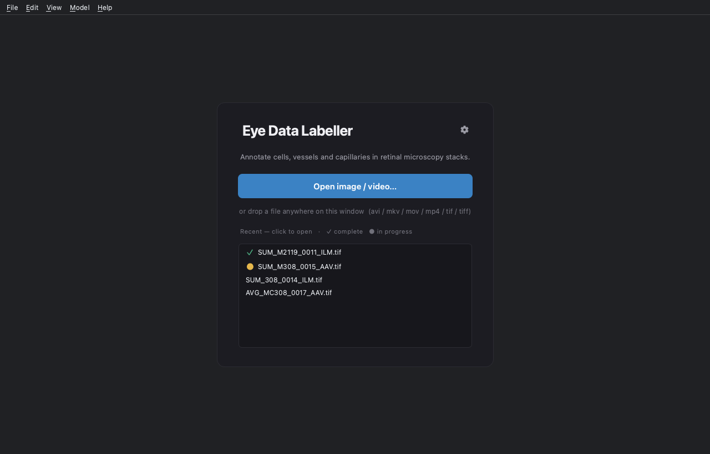

- **Open image / video…** — pick a stack (`.tif`/`.tiff`/`.avi`/`.mp4`/
  `.mkv`/`.mov`), or just **drag a file anywhere** onto the window.
- **Recent** — your last-opened stacks, each with a work-status mark:
  **✓ complete** (green) or **● in progress** (yellow); untouched files
  sort to the bottom. **Click one to open it.** Right-click to remove.
- **⚙ (gear, top-right)** — opens Settings.
- **Add SAM model…** — appears here only when no model is configured
  (see [§6](#6-the-sam-model)).

The editor's menus and shortcuts stay disabled on Home until a file is
open, so nothing you type here can have a surprising effect.

---

## 2. The annotation view

Open a stack and you land in the editor:

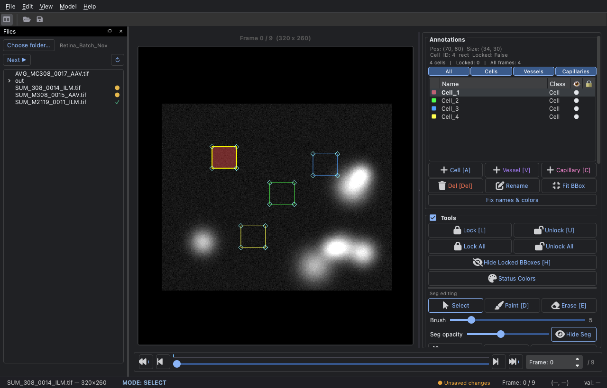

- **Menu bar** — File / Edit / View / **Model** / Help.
- **Toolbar** (top-left) — sidebar toggle (`Ctrl+B`), Open, Save.
- **Frame view** (centre) — the current frame; annotation boxes and
  the segmentation overlay draw on top.
- **Files sidebar** (left) — your folder of stacks with status glyphs
  (see [§5](#5-working-through-many-files)). Toggle with `Ctrl+B`.
- **Annotations panel** (right) — the list of cells/vessels/
  capillaries, class filter tabs, per-row colour / visibility / lock,
  and the **Tools** + **Seg editing** controls.
- **Timeline** (bottom) — scrub frames; the tick bar shows which
  frames already carry work.
- **Status bar** (very bottom) — the file name, the current **MODE**,
  the frame counter, and a Word-style save indicator
  (*● Unsaved changes* → *✓ Saved 2 min ago*).

---

## 3. Annotating a frame

1. **Add a cell** — press `A` (or double-click on the frame). Drag the
   box corners to fit the cell. Add a **vessel** with `V`, a
   **capillary** with `C`.
2. **Segment it** — two ways:
   - **SAM Box** (`B`): the model proposes a mask from the box. It
     appears first as a cyan **preview** — press `Enter` (or `B` again)
     to accept, `Esc` to discard. *Nothing touches your data until you
     accept.* (Requires a SAM model — [§6](#6-the-sam-model).)
   - **Paint** (`D`) / **Erase** (`E`): draw the mask by hand. `Ctrl+`
     mouse-wheel changes brush size. `F` fills the whole box.
3. **Lock + advance** — when an annotation is final, `Ctrl+L` locks it
   (read-only, won't be deleted) and jumps to the next one, giving the
   session a steady rhythm.
4. **Navigate frames** — `←`/`→` one at a time, `Home`/`End` for
   first/last, `Ctrl+←`/`Ctrl+→` to jump to the next frame with no
   annotations.

> Tip: a **locked** box can still be selected by clicking inside it,
> even when it has no painted mask.

---

## 4. Work status & saving

Status tracks reality automatically, so a folder of 1000 stacks stays
legible at a glance.

- **The moment you draw anything, the file becomes ● in progress** —
  no action needed.
- **Save** (`Ctrl+S`) writes the project and then asks how to record
  it:

  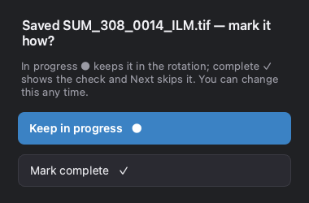

  **Keep in progress ●** (default — a quick `Enter` just checkpoints)
  or **Mark complete ✓**. Editing a file that was ✓ complete demotes it
  back to ● in progress.
- **Leaving a stack** (switch file, **File → Close** `Ctrl+W`, or quit)
  shows the same choice, plus **Discard** and **Cancel**, whenever
  there's unsaved work.
- **Auto-save** runs every 30 s in the background; a real Save cleans
  up its snapshot. Every save also keeps a `.bak` of the previous file
  and, once per session, a `backup/session-<timestamp>/` copy — so
  resuming and saving twice can never destroy what you resumed from.

Saved outputs live in **one folder per video** (`<out>/<stem>/` with
`Cells.tif`, `Vessels.tif`, `Capillaries.tif`, `Meta.json`,
`project.json`). Need masks grouped by type for a training pipeline?
**File → Collate masks by class** copies them into `Cells/ Vessels/
Capillaries/` folders on demand — the per-video layout is untouched.

---

## 5. Working through many files

Open the **Files sidebar** (`Ctrl+B`, or **View → Files Sidebar**) and
**Choose folder…** to point it at your batch:

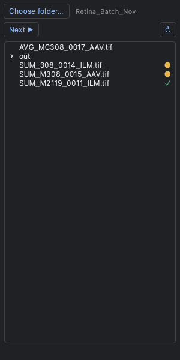

Each stack shows its status at a glance — **✓** complete, **●** in
progress, nothing for untouched. **Next ▶** opens the first stack that
isn't marked ✓, so a folder of 30 becomes a next-next-next session
instead of 30 manual opens. Right-click a file to open it or correct
its status. Statuses live in each stack's output folder, so they
travel with the data (and show up on the Home screen too).

---

## 6. The SAM model

The one-click **SAM Box** needs a checkpoint (`best.pt`, ~400 MB). It
does **not** ship with the app — get it from whoever runs your lab (a
shared drive / Box / USB). You register it **once**; it's remembered
across launches.

### First-time setup — adding your model

On a brand-new install with no model, the Home screen shows a dashed
**Add SAM model…** button, and the status line notes that segmentation
assist is off until you set one:

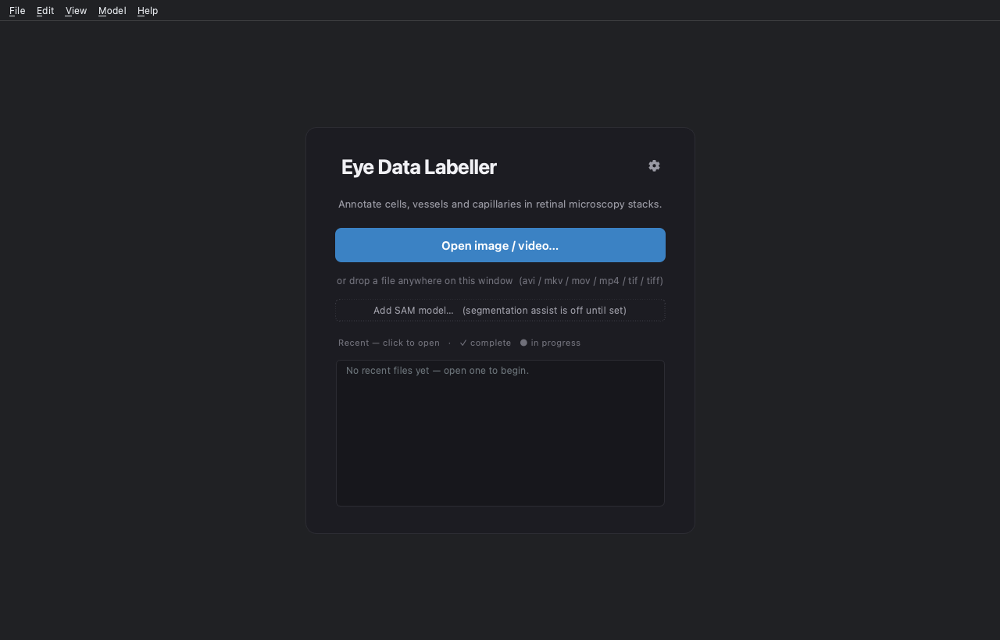

Click **Add SAM model…** (or, any time, the menu bar's **Model → Add
model…**) to open the registration form:

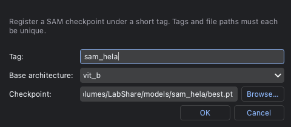

1. **Tag** — a short name you'll recognise, e.g. `sam_hela`.
2. **Base architecture** — the SAM variant the checkpoint was
   fine-tuned from. For the standard SAM-HeLa checkpoint that's
   **`vit_b`** (if unsure, ask whoever gave you the file).
3. **Checkpoint** — **Browse…** to your `best.pt`.
4. **OK** — the model is registered *and made active* immediately. The
   file is read in place (nothing is copied), so it can live on a
   network drive.

That's it — **SAM Box (`B`) now works.** Tags and file paths must each
be unique, so you can't accidentally register the same thing twice.

### Managing models later

**Settings → SAM Model** is the full registry — **Add / Edit /
Remove**, and **Make active** (● marks the active one). You can keep
several checkpoints registered and switch between them:

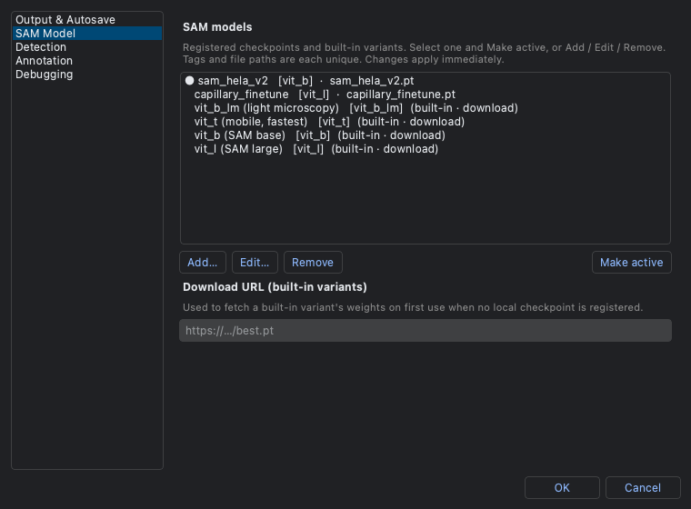

The active model also drives the **Model** dropdown in the annotation
view's right panel, so switching mid-session is one click. Built-in
variants (which download their weights on first use) are listed too.
Without any model, manual annotation works normally; only SAM Box is
disabled.

---

## 7. The Settings panel

Open **Settings** from the Home screen's **⚙ gear**, or **File →
Settings…**. It's organised into pages down the left:

### Output & Autosave

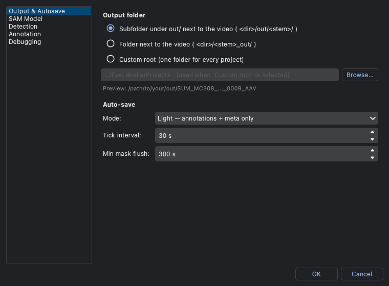

- **Output folder** — where saved masks land. The default,
  **Subfolder under `out/`** (`<video_dir>/out/<stem>/`), keeps each
  stack's results in their own folder next to the video. You can
  instead prefix (`<stem>_out/`) or send everything under one
  **Custom root**.
- **Auto-save** — **Mode** (*Light* = annotations + meta; *Smart* also
  flushes masks periodically; *Off*), the **Tick interval** (default
  30 s), and, in Smart mode, the **Min mask flush** gap.

### SAM Model

The model registry — see [§6](#6-the-sam-model).

### Detection

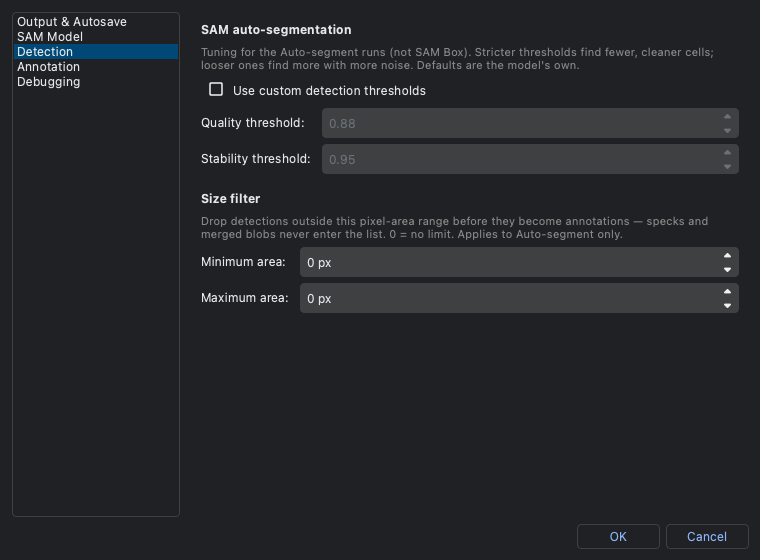

Tuning for the **Auto-segment** runs (not SAM Box): optional custom
**quality / stability thresholds** (stricter = fewer, cleaner cells)
and a **min/max pixel-area** size filter that drops specks and merged
blobs. Leave it on defaults unless auto-segment is over- or
under-detecting.

### Annotation

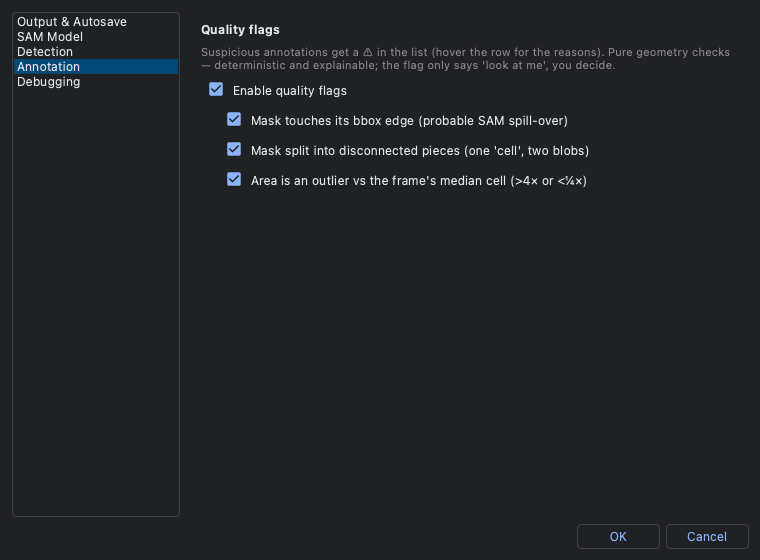

**Quality flags** — optional automatic ⚠ warnings on annotations that
look off (touching the frame edge, suspiciously split, or an unusual
area), so a reviewer can spot likely mistakes quickly. Toggle the
whole feature and each individual check.

### Debugging

Detailed logging + the log folder — see
[§9](#9-logging--debugging-please-read-before-reporting-a-problem).

---

## 8. Keyboard shortcuts

Press **`F1`** any time for the in-app cheat sheet:

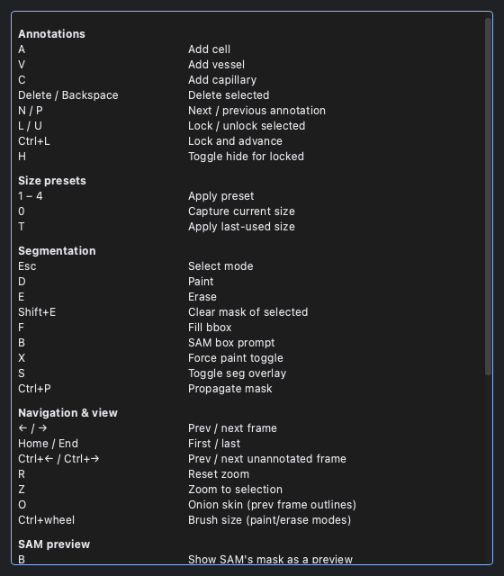

The complete table (with every mode) is in
[USAGE.md → Keyboard shortcuts](USAGE.md#keyboard-shortcuts). The ones
you'll use most: `A` add cell · `B` SAM Box · `D`/`E` paint/erase ·
`Ctrl+L` lock & advance · `Ctrl+S` save · `Ctrl+B` sidebar ·
`Ctrl+W` close.

---

## 9. Logging & debugging (please read before reporting a problem)

If something misbehaves, the log files are what let us fix it fast.

**Turn on detailed logging** — **Settings → Debugging**:

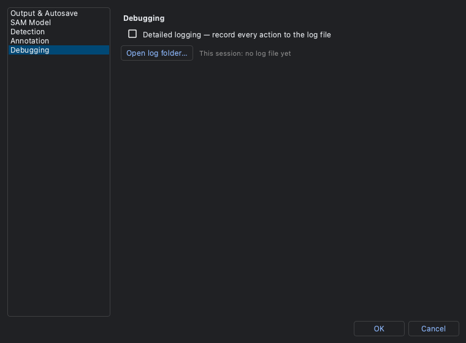

- **Detailed logging — record every action to the log file.** Errors
  are *always* logged; ticking this box **also** records every action
  (frame changes, SAM runs, saves, brush strokes…). It applies
  immediately and persists across launches.
- **Open log folder…** — jumps straight to the logs, and the line next
  to it names **this session's** log file.

**Where the logs live** — one file per app session, newest **20** kept:

| OS | Log folder |
| --- | --- |
| macOS | `~/Library/Application Support/EyeDataLabeller/logs/` |
| Linux | `~/.local/share/EyeDataLabeller/logs/` |
| Windows | `%LOCALAPPDATA%\EyeDataLabeller\logs\` |

Files are named `session_<date>_<time>_<pid>.log`.

**From a terminal (source install):** launch with `--debug` to record
everything from the very first line, e.g. `python main.py --debug` (or
add `--debug` to your Desktop launcher command).

**When you hit a bug — the 3-step report:**

1. Turn on **Detailed logging** (above), then reproduce the problem.
2. **Settings → Debugging → Open log folder…** and grab the **newest**
   `session_*.log`.
3. Send that file with a one-line description of what you did and what
   went wrong. That log usually pinpoints the exact step.

> The logs contain file paths and actions only — no image data. Errors
> are captured even with detailed logging **off**, so the newest log is
> always worth sending.

---

Questions or a stack that won't open? Grab the newest log
(§8) and open an issue on the
[repository](https://github.com/HakkiMotorcu/Eye_Data_Labeller/issues).
